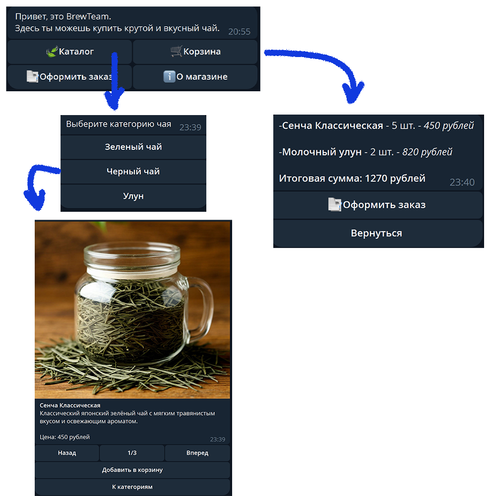

# Aiogram Telegram Bot - бот по продаже чаев "BrewTeam"

Телеграм бот по продаже чаев с разными категориями, корзиной, оформлением заказа через Юкасса.

## Описание проекта

Бот работает в режиме polling. Имеется админ панель с большим функционалом.

## Технологический стек

- [Python](https://www.python.org/)
- [Aiogram 3](https://docs.aiogram.dev/en/dev-3.x/)
- [Redis](https://redis.io/)
- [Postgresql](https://www.postgresql.org/)

## Реализованные функции

- Добавление пользователя в БД на старте
- База для хранения данных - postgresql, для хранения состояний - redis
- Администрирование через telegram по специальной команде доступной определенному пользователю

### Администрирование

- Изменение категорий чаев
- Изменение товаров (чаев)
- Просмотр заказов
- Рассылка объявлений
- Просмотр статистики
- Список пользователей

### Клиентская часть

- Выбор категорий и чаев
- Добавление товаров в корзину
- Оформление заказа

## Фото интерфейса
### Клиентская сторона

